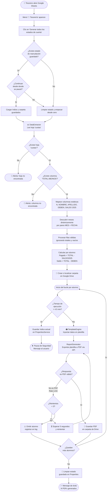

# 🏦 Sistema de Tesorería de Curso
### Automatización de Estados de Cuenta — Google Sheets + Apps Script

> Genera estados de cuenta individuales en PDF para cada apoderado, directamente desde una planilla Google Sheets, con cálculos automáticos y entrega organizada en Google Drive.

---

## 📋 Descripción General

Este sistema fue diseñado para el **tesorero de curso**, permitiéndole generar en minutos un estado de cuenta personalizado para cada apoderado, sin necesidad de conocimientos técnicos. El proceso es completamente auditable y resistente a errores.

### Características principales

| Característica | Detalle |
|---|---|
| 🔄 **Mapeo dinámico de columnas** | Detecta meses nuevos automáticamente sin modificar el código |
| 🧾 **PDFs individuales** | Un archivo por alumno, nombrado y guardado en Drive |
| 📊 **Dashboard Consolidado** | Exportación a demanda del resumen financiero del curso |
| 🔁 **Reanudación inteligente** | Si Google interrumpe el proceso, puede continuar desde donde pausó |
| 🛡️ **Anti-Rate Limiting** | Reintenta automáticamente si los servidores de Google se saturan |
| 📐 **Fórmula contable auditada** | Validada iterativamente contra la planilla real |
| 🍔 **Menú integrado en Sheets** | Sin necesidad de entrar al editor de código |

---

## 🗂️ Archivos del Proyecto

```
faby/
├── app_pagos.gs          ← Script principal (5 módulos, ~415 líneas)
├── MANUAL_TESORERO.md    ← Manual de uso para el tesorero
├── README.md             ← Este archivo (documentación técnica)
├── spec.md               ← Especificaciones funcionales del sistema
├── agent.md              ← Diseño de módulos (arquitectura de agentes)
├── memory.md             ← Registro de decisiones y razonamiento técnico
└── task.md               ← Checklist de desarrollo (todas las etapas)
```

---

## 🏗️ Arquitectura del Sistema

El script `app_pagos.gs` está compuesto por **5 módulos independientes** con responsabilidades únicas:

### Módulo 1 — `DataExtractor`
- Lee la hoja `cuotas` y mapea dinámicamente todas las columnas.
- Descubre los meses de recaudación leyendo los pares `[MES] + [FECHA]`.
- Ignora filas inválidas (totales, celdas vacías, fila de SALDO).
- Calcula `TOTAL_ABONOS` (solo abonos del año) y `SALDO_FINAL`.

### Módulo 2 — `TemplateEngine`
- Inyecta los datos de cada alumno en las celdas de la hoja `plantilla_estado_cuenta`.
- Limpia los datos del alumno anterior antes de cada escritura.
- Soporta hasta 3 movimientos de pago por mes.

### Módulo 3 — `ReportGenerator`
- Orquesta el flujo completo en un bucle por alumno.
- Exporta la plantilla como PDF usando la API interna de Google.
- Valida que la respuesta sea un PDF real (no HTML de error).
- Implementa reanudación con `PropertiesService` para superar el límite de 6 minutos.

### Módulo 4 — `UIManager`
- Crea el menú **"🏦 Tesorería"** al abrir la planilla (`onOpen`).
- Expone las funciones principales sin necesidad de usar el editor de Apps Script (Generación masiva y Reporte consolidado).

### Módulo 5 — `DashboardExporter`
- Exporta de manera independiente la hoja `dashboard` a PDF (orientado a presentaciones directivas o apoderados).
- Ajusta el formato automáticamente a una página (Fit-to-Width).
- Reutiliza el patrón Anti-Rate Limit del Módulo 3 para tolerancia a fallos.

---

## 🔄 Diagrama de Flujo



---

## 📐 Fórmula Contable

La planilla `cuotas` tiene una columna `TOTAL ABONOS` que **ya incluye** el saldo histórico del año anterior (`SALDO 2025`). Por esta razón, el script separa ambos valores para presentar un estado de cuenta claro al apoderado:

```
Total Pagado en el Año  =  TOTAL ABONOS (en hoja)  −  SALDO 2025
Saldo Final Actual      =  TOTAL ABONOS (en hoja)  −  DEBEN
```

**Ejemplo (Alumna N°5 — Astudillo Morales Martina Ignacia):**

| Campo | Valor |
|---|---|
| TOTAL ABONOS (en hoja) | $60.086 |
| SALDO 2025 (arrastre) | $28.086 |
| DEBEN (deuda) | $0 |
| **Total Pagado a la Fecha** (en PDF) | **$32.000** (= 60.086 − 28.086) |
| **Saldo Final Actual** (en PDF) | **$60.086** (= 60.086 − 0) |

---

## 📊 Estructura requerida de la hoja `cuotas`

La hoja **debe llamarse exactamente `cuotas`**. La fila 1 debe contener los encabezados:

```
N | NOMBRE | APELLIDO | DEBEN | SALDO 2025 | MARZO | FECHA | ABRIL | FECHA | ... | TOTAL ABONOS
```

> **Regla de detección de meses:** Cualquier columna seguida inmediatamente de una columna `FECHA` es interpretada como un mes de recaudación. Se puede agregar meses nuevos sin modificar el código.

---

## ⚙️ Configuración de Celdas en la Plantilla

El objeto `TEMPLATE_CONFIG` en el código define qué celda de la hoja `plantilla_estado_cuenta` recibe cada dato:

```javascript
const TEMPLATE_CONFIG = {
  NOMBRE:              'C3',   // Nombre completo del alumno
  N_LISTA:             'F3',   // Número de lista
  DEUDA_ARRASTRE:      'F5',   // DEBEN
  SALDO_FAVOR:         'C5',   // SALDO 2025
  TOTAL_PAGADO:        'C6',   // Abonos del año actual
  SALDO_FINAL:         'F6',   // Saldo final calculado
  MOVIMIENTOS_START_ROW: 10,   // Fila donde comienza la tabla de movimientos
  MOVIMIENTOS_COLS: {
    MES:   2,                  // Columna B
    FECHA: 3,                  // Columna C
    MONTO: 4                   // Columna D
  }
};
```

Para cambiar el diseño visual de la plantilla, solo modifica estas coordenadas.

---

## 🧪 Pruebas de Integración Realizadas (QA)

| Test | Descripción | Resultado |
|---|---|---|
| QA-1 | Menú "🏦 Tesorería" al abrir planilla | ✅ Pasó |
| QA-2 | Mes nuevo (`AGOSTO`) detectado automáticamente | ✅ Pasó |
| QA-3 | Hasta 3 cuotas en un mismo mes procesadas | ✅ Pasó |
| QA-4 | Fila de SALDO al final de la hoja ignorada | ✅ Pasó |
| QA-5 | Cálculos contables correctos en PDFs | ✅ Pasó |

---

## ⚠️ Limitaciones Conocidas

| Limitación | Detalle |
|---|---|
| **Límite de 6 minutos de Google** | Cuentas gratuitas de Apps Script tienen un tope de 6 minutos por ejecución. El sistema lo maneja automáticamente con reanudación. |
| **Rate Limiting de la API de exportación** | Si se hacen muchas solicitudes de PDF seguidas, Google puede devolver HTML de error. El sistema reintenta hasta 3 veces con pausa de 5 segundos entre cada intento. |
| **Máximo 3 pagos por mes** | El sistema soporta hasta 3 pares de columnas `MES/FECHA` por mes. Este límite fue validado con el tesorero como suficiente para los casos reales del curso. |

---

## 🔧 Mantenimiento Anual

Al inicio de un nuevo año escolar:

1. Duplica la planilla actual para archivar el historial.
2. En `app_pagos.gs`, actualiza la clave del `colMap`:
   ```javascript
   // Cambiar 'SALDO 2025' por el año nuevo
   SALDO_2025: getColIndex('SALDO 2026'),
   ```
3. Actualiza el encabezado de la columna en la hoja `cuotas` para que coincida.
4. Limpia los valores de los meses del año anterior.

---

## 📁 Historial de Decisiones de Diseño

Consulta [memory.md](./memory.md) para el registro completo de decisiones arquitectónicas, correcciones de bugs, análisis de fallos y el razonamiento detrás de cada decisión técnica del proyecto.

---

*Proyecto desarrollado con Google Apps Script · Versión 1.0 · 2026*
